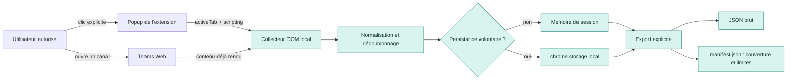

# Teams Channel Archive — local

> Extension Chrome locale pour créer une **archive de consultation** à partir du contenu déjà rendu dans un canal Teams Web auquel tu as accès.

[](https://developer.chrome.com/docs/extensions/develop/migrate/what-is-mv3)
[](LICENSE)

## État du projet

**V0.2.2 — chaque référence d’image conserve son horodatage source.**

La V0.2.2 permet une capture locale des éléments **actuellement rendus** dans un canal Teams Web actif ou une conversation personnelle Teams Free, avec exports JSON, Markdown et manifeste de couverture. Le Markdown isole strictement `[data-message-content]` : noms répétés, heures d’interface, contrôles et réactions sont exclus du texte, tandis que les images rendues restent conservées. Chaque référence d’image contient aussi son propre horodatage source, afin que les messages visuels restent traçables même sans texte. Une qualification Teams Free du 17 septembre 2026 a confirmé l’export de 10 messages rendus sur 10 attendus. Le correctif du 18 septembre cible, y compris sur `teams.microsoft.com`, les vraies cartes de conversation `message-wrapper` avec un corps `message-body-*`, au lieu des aperçus de navigation `comfy-message-wrapper` qui provoquaient un export vide après filtrage de période. Le Markdown utilise du texte cité, pas le HTML Teams ; les images sont téléchargées seulement depuis des URL HTTP(S) déjà rendues et uniquement par clic explicite. Les détails et limites sont dans [la note de compatibilité](docs/COMPATIBILITY.md).

Elle ne réalise pas encore la remontée automatisée de deux ans d’historique ni l’ouverture systématique des fils ; ces fonctions restent à qualifier et implémenter.

> [!WARNING]
> Cette extension n’est pas un export Microsoft Purview/eDiscovery, ne contourne aucun droit Teams, et ne doit jamais être présentée comme une archive intégrale ou juridiquement probante.

## Ce que fait l’extension

- agit uniquement après un clic explicite dans l’onglet Teams Web actif ;
- demande à l’utilisateur de confirmer qu’il est autorisé à archiver le canal ;
- collecte les éléments que Teams a déjà rendus dans le navigateur ;
- normalise le contenu, dédoublonne les messages, applique une période de consultation et signale les données incomplètes ;
- conserve les données dans la session du navigateur, ou dans le stockage local de l’extension si l’utilisateur coche explicitement cette option ;
- exporte un JSON brut, un `manifest.json` et une transcription Markdown lisible expliquant le périmètre, les compteurs et les limites ;
- peut télécharger, après un clic distinct et explicite, les images HTTP(S) déjà rendues dans le contenu ou les aperçus de pièce jointe ;
- permet l’effacement explicite des données locales.

## Ce que l’extension ne fait pas

- ne lit ni cookies, ni mots de passe, ni jetons Microsoft ;
- ne contourne ni MFA, ni permissions Teams, ni rétention Microsoft 365 ;
- n’appelle pas Microsoft Graph ou des API Teams privées ;
- n’envoie pas les messages à un serveur, une IA, un analytics ou un tiers ;
- ne télécharge pas les pièces jointes génériques ni les vidéos ; seules les images déjà rendues sont éligibles après clic explicite ;
- ne récupère pas les messages supprimés, purgés ou invisibles pour le compte connecté ;
- ne promet pas une couverture exhaustive.

## Schéma



L’extension reste entièrement dans le navigateur. Le seul contenu qui sort est celui que l’utilisateur choisit de télécharger localement.

## Installation dans Chrome / Chromium

### Prérequis

- Chrome ou Chromium récent ;
- un compte autorisé à consulter le canal Teams cible ;
- Teams ouvert dans le navigateur, sur `teams.microsoft.com`, `teams.cloud.microsoft` ou `teams.live.com` ;
- pour Teams Free (`teams.live.com`), l’extension prend en charge les conversations personnelles rendues ; la capture visible a été qualifiée sur un jeu de test local. Les longs historiques et les fils restent hors périmètre V0.1.

### Charger l’extension depuis le dépôt cloné

1. Clone le dépôt :

   ```bash
   git clone https://github.com/elricvo/web-teams-chrome-plugin.git
   ```

2. Ouvre `chrome://extensions` dans Chrome, ou `chromium://extensions` dans Chromium.
3. Active le **Mode développeur** en haut à droite.
4. Clique sur **Charger l’extension non empaquetée**.
5. Sélectionne le dossier racine cloné : `web-teams-chrome-plugin/`.
6. Épingle l’icône **Teams Channel Archive — local** dans la barre d’outils du navigateur.

Aucune installation `npm`, aucun build et aucun serveur ne sont nécessaires pour charger la V0.1.

## Utilisation V0.1

1. Dans Teams Web, ouvre **le canal précis** que tu es autorisé à archiver.
2. Vérifie visuellement le Team et le canal avant toute action.
3. Ouvre l’extension depuis la barre d’outils.
4. Lis l’avertissement puis coche : « Je confirme être autorisé à archiver ce canal ».
5. Facultatif : choisis une période de consultation et coche la persistance locale si tu souhaites conserver temporairement la session après fermeture.
6. Clique sur **Capturer les éléments actuellement rendus**.
7. Lis le statut et les limites affichées. En V0.1, il est normal qu’un état `partial` soit signalé.
8. Clique sur **Exporter JSON + manifeste** pour le corpus structuré, ou **Exporter Markdown lisible** pour une lecture humaine.
9. Facultatif : clique séparément sur **Télécharger les images rendues**. Seules les balises d’image HTTP(S) déjà visibles dans le contenu ou les aperçus de pièce jointe sont demandées à Chrome ; les vidéos, `blob:` et `data:` sont ignorés. Les fichiers sont placés dans `teams-archive-images/YYYY-MM-DD/` sous le dossier de téléchargement Chrome et les liens peuvent échouer s’ils ont expiré ou exigent un accès non disponible au téléchargement.
10. Après usage, clique sur **Effacer la session locale**.

### Fichiers exportés

| Fichier | Contenu | Usage |
|---|---|---|
| `teams-archive-YYYY-MM-DD.json` | Messages/réponses capturés et métadonnées de session | Transformation et analyse locale ultérieures |
| `teams-archive-YYYY-MM-DD.md` | Transcription chronologique lisible, avec les messages cités | Lecture humaine, Obsidian ou traitement Markdown local |
| `teams-archive-images/YYYY-MM-DD/` | Images HTTP(S) rendues, téléchargées seulement à la demande | Références locales mentionnées dans le Markdown ; absence possible en cas de lien expiré/refusé |
| `teams-archive-YYYY-MM-DD-manifest.json` | Canal, période, compteurs, erreurs, bornes observées, limites | Lire la couverture et ne pas surinterpréter l’archive |

## Développement

```bash
npm test
```

Les tests unitaires couvrent notamment :

- sanitation du HTML non fiable ;
- normalisation des messages incomplets ;
- dédoublonnage ;
- filtre de période ;
- rattachement des réponses ;
- génération du manifeste de couverture.

## Documentation

- [Spécification fonctionnelle](docs/specs/001-local-teams-channel-archive/spec.md)
- [Plan technique](docs/specs/001-local-teams-channel-archive/plan.md)
- [Recherche et décisions](docs/specs/001-local-teams-channel-archive/research.md)
- [Plan de contrôle](docs/CONTROL-PLAN.md)
- [Compatibilité et résultat de qualification](docs/COMPATIBILITY.md)
- [Protocole d’installation et de test](docs/INSTALL-TEST.md)
- [Tâches restantes](docs/specs/001-local-teams-channel-archive/tasks.md)

## Prochain jalon : spike Teams Web

Avant toute collecte longue, il faut qualifier le DOM Teams sur un canal de test autorisé : sélecteurs, identifiants disponibles, chargement rétroactif, virtualisation, fils de discussion et arrêt propre en cas de changement de canal. Les critères de go/no-go sont décrits dans le [plan de contrôle](docs/CONTROL-PLAN.md).

## Licence

Distribué sous licence [MIT](LICENSE).
