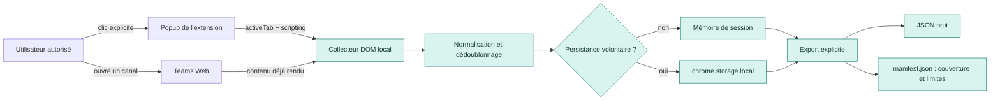

<h1> Teams Channel Archive — local</h1>

> Extension Chrome locale pour créer une **archive de consultation** à partir du contenu déjà rendu dans un canal Teams Web auquel tu as accès.

[](https://developer.chrome.com/docs/extensions/develop/migrate/what-is-mv3)
[](LICENSE)

## État du projet

**V1.0.3 — logo Cloudseeders intégré dans l’en-tête des archives Markdown.**

La V1.0 permet une capture locale du contenu rendu dans un canal Teams Web actif ou une conversation personnelle Teams Free, avec exports JSON, Markdown et manifeste de couverture. Après un clic explicite, une date de début obligatoire et la confirmation d’autorisation, elle peut faire remonter automatiquement le panneau de messages : chaque lot rendu est dédoublonné et sauvegardé localement avant la virtualisation suivante. Le Markdown isole strictement `[data-message-content]`, exclut contrôles et réactions, et intègre les images rendues sous forme Markdown locale avec leur horodatage ; elles deviennent visibles dans un lecteur Markdown après le téléchargement explicite correspondant. L’automatisation s’arrête à la date cible, au haut stable de l’historique, au plafond choisi, à la demande de l’utilisateur ou dès que la conversation devient ambiguë. Elle ne promet jamais une archive exhaustive et ne force pas l’ouverture des fils. Les décisions, l’architecture et limites sont documentées dans [la conception de collecte automatique](docs/AUTOMATED-HISTORY-COLLECTION.md).

> [!WARNING]
> Cette extension n’est pas un export Microsoft Purview/eDiscovery, ne contourne aucun droit Teams, et ne doit jamais être présentée comme une archive intégrale ou juridiquement probante.

## Ce que fait l’extension

- agit uniquement après un clic explicite dans l’onglet Teams Web actif ;
- demande à l’utilisateur de confirmer qu’il est autorisé à archiver le canal ;
- collecte les éléments que Teams a déjà rendus dans le navigateur ;
- après un clic distinct et une date cible, peut remonter automatiquement le panneau Teams à cadence limitée, en mémorisant chaque lot rendu avant virtualisation ;
- normalise le contenu, dédoublonne les messages, applique une période de consultation et signale les données incomplètes ;
- conserve les données dans la session du navigateur, ou dans le stockage local de l’extension si l’utilisateur coche explicitement cette option ;
- exporte un JSON brut, un `manifest.json` et une transcription Markdown lisible expliquant le périmètre, les compteurs et les limites ;
- peut sauvegarder en un clic un dossier autonome dans les téléchargements Chrome : le Markdown et le sous-dossier `images/` utilisent des liens relatifs, pour un affichage natif après téléchargement ;
- le document Markdown embarque le logo Cloudseeders sous forme d’image locale encodée, à gauche du titre : il est donc visible même si le fichier Markdown est déplacé seul ;
- permet l’effacement explicite des données locales.

## Ce que l’extension ne fait pas

- ne lit ni cookies, ni mots de passe, ni jetons Microsoft ;
- ne contourne ni MFA, ni permissions Teams, ni rétention Microsoft 365 ;
- n’appelle pas Microsoft Graph ou des API Teams privées ;
- n’envoie pas les messages à un serveur, une IA, un analytics ou un tiers ;
- ne télécharge pas les pièces jointes génériques ni les vidéos ; seules les images déjà rendues sont éligibles après clic explicite ;
- ne récupère pas les messages supprimés, purgés ou invisibles pour le compte connecté ;
- ne promet pas une couverture exhaustive ;
- n’ouvre pas systématiquement les fils ni les réponses que Teams ne rend pas déjà.

## Schéma



L’extension reste entièrement dans le navigateur. Le seul contenu qui sort est celui que l’utilisateur choisit de télécharger localement.

## Installation dans Chrome / Chromium

### Prérequis

- Chrome ou Chromium récent ;
- un compte autorisé à consulter le canal Teams cible ;
- Teams ouvert dans le navigateur, sur `teams.microsoft.com`, `teams.cloud.microsoft` ou `teams.live.com` ;
- pour Teams Free (`teams.live.com`), l’extension prend en charge les conversations personnelles rendues ; les sélecteurs de scroll long restent à qualifier sur chaque interface Teams cible.

### Charger l’extension depuis le dépôt cloné

1. Clone le dépôt :

   ```bash
   git clone https://github.com/elricvo/web-teams-chrome-plugin.git
   ```

2. Ouvre `chrome://extensions` dans Chrome, ou `chromium://extensions` dans Chromium.
3. Active le **Mode développeur** en haut à droite.
4. Clique sur **Charger l’extension non empaquetée**.
5. Sélectionne le dossier racine cloné : `web-teams-chrome-plugin/`.
6. Épingle l’icône **Teams Channel Archive — local** dans la barre d’outils du navigateur.

Aucune installation `npm`, aucun build et aucun serveur ne sont nécessaires pour charger l’extension.

## Utilisation V1.0

1. Dans Teams Web, ouvre **le canal précis** que tu es autorisé à archiver.
2. Vérifie visuellement le Team et le canal avant toute action.
3. Ouvre l’extension depuis la barre d’outils.
4. Lis l’avertissement puis coche : « Je confirme être autorisé à archiver ce canal ».
5. Renseigne la date **Du** pour la collecte automatique ; choisis facultativement une date de fin, la persistance locale et un plafond de lots.
6. Pour la seule vue actuelle, clique **Capturer les éléments actuellement rendus** ; pour remonter l’historique sans manipuler le fil, clique **Collecter l’historique automatiquement** et laisse l’onglet Teams ouvert.
7. Lis le statut, le motif d’arrêt et les limites affichées. L’état `partial` reste normal, y compris quand la date cible est atteinte.
8. Clique sur **Exporter JSON + manifeste** pour le corpus structuré, ou **Exporter Markdown lisible** pour une lecture humaine.
9. Pour une archive lisible et portable, clique **Sauvegarder Markdown + images** : Chrome crée sous son dossier de téléchargements un dossier `teams-archive-<horodatage>/`, avec le `.md` et `images/` ; les liens Markdown sont relatifs et les images s’affichent nativement après un téléchargement réussi. Les liens protégés/expirés restent signalés comme absents.
10. Facultatif : clique séparément sur **Télécharger les images rendues** si tu préfères le répertoire d’images historique indépendant.
11. Après usage, clique sur **Effacer la session locale**.

### Fichiers exportés

| Fichier | Contenu | Usage |
|---|---|---|
| `teams-archive-YYYY-MM-DD.json` | Messages/réponses capturés et métadonnées de session | Transformation et analyse locale ultérieures |
| `teams-archive-<horodatage>/teams-archive-<horodatage>.md` + `images/` | Dossier Markdown autonome : le document référence `images/image-XXX.ext` relativement | Lecture native dans Obsidian ou un lecteur Markdown, après téléchargement réussi des images |
| `teams-archive-images/YYYY-MM-DD/` | Images HTTP(S) rendues, téléchargées seulement à la demande | Références locales mentionnées dans le Markdown ; absence possible en cas de lien expiré/refusé |
| `teams-archive-YYYY-MM-DD-manifest.json` | Canal, période, compteurs, erreurs, bornes observées, limites | Lire la couverture et ne pas surinterpréter l’archive |

## Développement

```bash
npm test
```

Les tests unitaires couvrent notamment :

- sanitation du HTML non fiable ;
- normalisation des messages incomplets ;
- dédoublonnage ;
- filtre de période ;
- rattachement des réponses ;
- génération du manifeste de couverture.

## Documentation

- [Spécification fonctionnelle](docs/specs/001-local-teams-channel-archive/spec.md)
- [Plan technique](docs/specs/001-local-teams-channel-archive/plan.md)
- [Recherche et décisions](docs/specs/001-local-teams-channel-archive/research.md)
- [Conception de la collecte automatique](docs/AUTOMATED-HISTORY-COLLECTION.md)
- [Plan de contrôle](docs/CONTROL-PLAN.md)
- [Compatibilité et résultat de qualification](docs/COMPATIBILITY.md)
- [Protocole d’installation et de test](docs/INSTALL-TEST.md)
- [Tâches restantes](docs/specs/001-local-teams-channel-archive/tasks.md)

## Qualification V1.0 avant corpus de production

Le socle V1.0 est testé automatiquement et empaqueté, mais la qualification interactive dans chaque interface Teams cible reste obligatoire : sélecteurs, chargement rétroactif, virtualisation, fils de discussion, arrêt propre et contrôle réseau. Les critères de go/no-go sont décrits dans le [plan de contrôle](docs/CONTROL-PLAN.md).

## Licence

Distribué sous licence [MIT](LICENSE).
